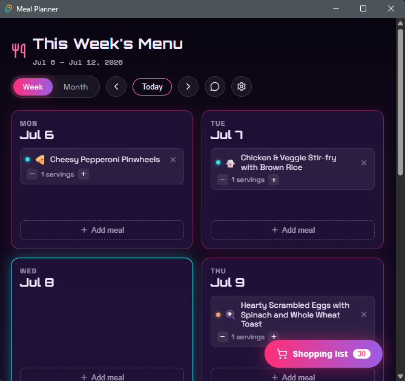

# 🍽️ Meal Planner

A synthwave-themed meal planning app that runs as a native desktop app (Linux, Windows) and an Android app — built with React + [Tauri v2](https://v2.tauri.app/), with AI-powered meal suggestions.

Plan your week or month, get AI-generated meal ideas based on what you're craving, and generate a smart shopping list that knows real store package sizes (need 2 cups of milk? It tells you to buy a quart).



## Features

- **Week & month calendar views** — assign meals to any day, adjust portion sizes per meal
- **AI meal suggestions** — describe what you're in the mood for and get tailored meal ideas with full ingredient lists, prices, and cooking instructions. Suggestions are cached in the background so the picker opens instantly.
- **Ask AI** — a built-in chat panel for cooking questions, substitutions, and technique help
- **Meal details** — tap any planned meal to see its ingredients (scaled to your serving count) and step-by-step instructions
- **Smart shopping list** — aggregates every ingredient across your planned range, groups by store section, estimates costs, and rounds quantities up to realistic store packages (quarts, dozens, pound bags…)
- **Your own meals** — save custom recipes or star AI suggestions to reuse them
- **Local-first storage** — all your data stays on your device

## The AI setup (bring your own key)

The app uses a local-first, cloud-fallback approach:

1. **Local:** if you have [Ollama](https://ollama.com/) running (desktop only), it's used first — free, private, offline.
2. **Cloud fallback:** otherwise it falls back to Google Gemini's free API tier. You'll need your own (free) API key from [aistudio.google.com/apikey](https://aistudio.google.com/apikey) — no credit card required. The app walks you through this on first launch, and the key is stored only on your device.

There is no shared/central API key — every user brings their own free key. This keeps the app free to run and means your AI usage is entirely your own.

## Install

### Android

Grab the APK from the [latest release](../../releases/latest), open it on your phone, and allow the install when prompted (standard warning for apps outside the Play Store).

### Desktop (build from source)

Prerequisites: [Node.js](https://nodejs.org/) (LTS), [Rust](https://rustup.rs/), and Tauri's [platform prerequisites](https://v2.tauri.app/start/prerequisites/) for your OS.

```bash
git clone https://github.com/nichols9494/meal-planner.git
cd meal-planner
npm install
npx tauri dev          # run the desktop app in dev mode
npx tauri build        # build a release binary/bundle for your OS
```

Notes from the trenches:

- **Linux (Fedora 40+/immutable distros like Bazzite):** build inside a [Distrobox](https://distrobox.it/) container with FUSE enabled, and use `NO_STRIP=1 npx tauri build --bundles appimage` to work around a `linuxdeploy` incompatibility with newer glibc (`.relr.dyn` sections).
- **Windows:** the Rust installer will offer to install the required Microsoft C++ Build Tools — say yes.

### Android (build from source)

Requires Android Studio (SDK + NDK + command-line tools), the Rust Android targets (`rustup target add aarch64-linux-android armv7-linux-androideabi i686-linux-android x86_64-linux-android`), and a signing keystore (see [Tauri's Android signing guide](https://v2.tauri.app/distribute/sign/android/)).

```bash
npx tauri android init
npx tauri android build --apk
```

## Tech stack

- **Frontend:** React + Vite, custom CSS (synthwave all the way down)
- **Native shell:** Tauri v2 (Rust) — one codebase for Linux, Windows, and Android
- **AI:** Ollama (local) with Google Gemini fallback, routed through the Rust backend so API keys never touch frontend code
- **Storage:** browser localStorage via a small storage helper

## License

No license yet — all rights reserved for now. Open an issue if you'd like to use this for something.
